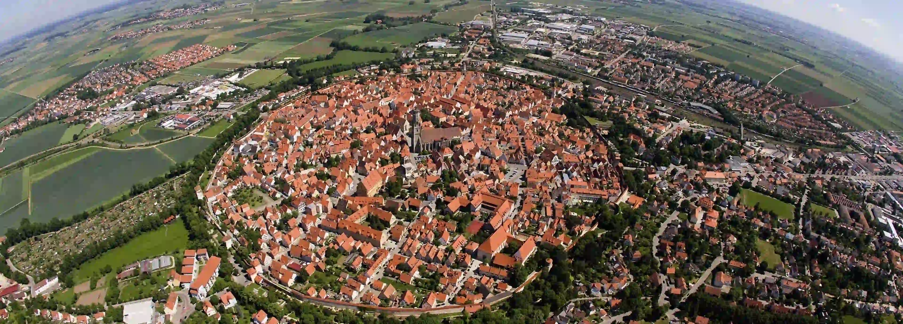
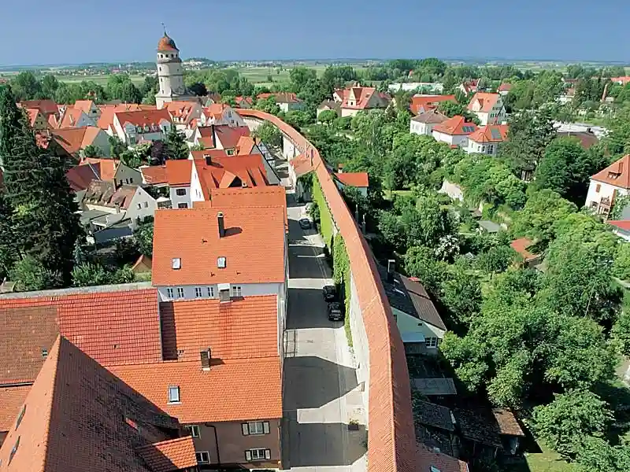
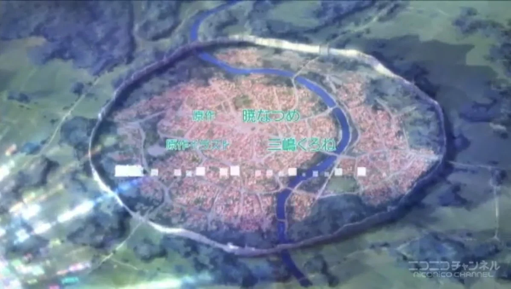
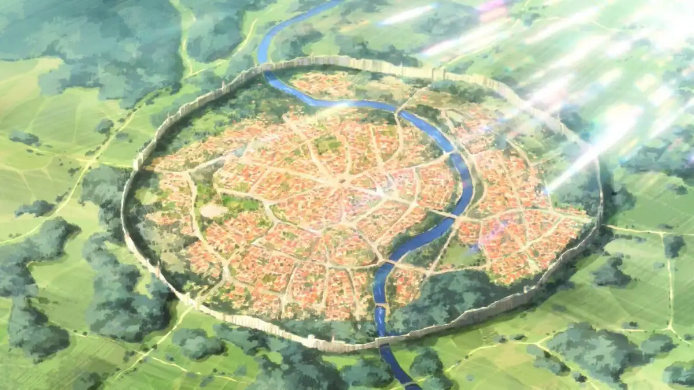
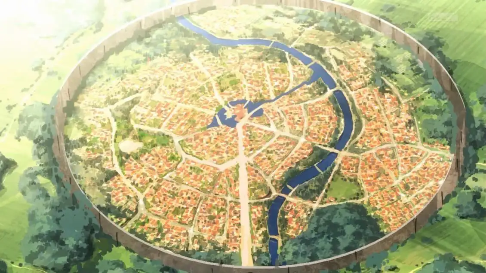

kembali lagi bersama sekai.id kali ini sekai.id membahas “Nördlingen Kota Yang Menjadi Inspirasi Anime Genre Isekai”

kalian sudah pada tau kan bahwa kota di anime ber genre isekai itu mirip2, jika tidak mau dibilang sama 😀

kota berbentuk lingkaran dengan dinding tinggi yang mengitari kota tersebut benar2 ada loh di dunia nyata

kota tersebut adalah Nördlingen. yaitu sebuah kota yang terletak di Distrik Donau-Ries, Swabia, Bavaria, Jerman

kota Nördlingen berbentuk lingkaran karena kota tersebut dibangun di kawah meteor

kota nordlingen juga memiliki dinding tinggi yang mengelilingi kota <s>yang bisa melindungi penduduk kota dari serangan titan</s>

Kota Di Anime KonoSuba

Kota Di Anime Tate no Yuusha no Nariagari

Kota Di Anime Kenja no Mago
