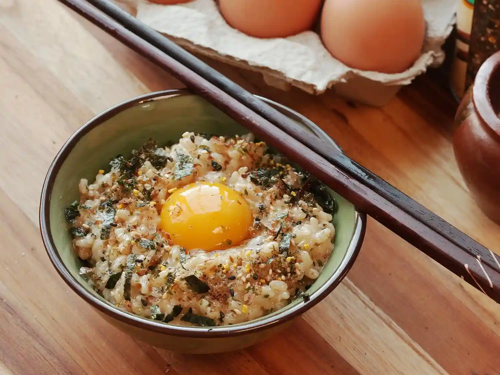

jika kalian sering melihat Anime / browsing tentang Jepang kalian mungkin sudah tidak asing dengan yang namanya _Tamago Kake Gohan_, ya telur mentah dicampur _shoyu_ yang di aduk bersama dengan nasi hangat. terkadang juga diberi _Nattō_ taburan _Nori_ dan taburan lain untuk menambah rasa

jika kalian ingin mencoba _Tamago Kake Gohan_ cara buat nya sangat mudah

Berikut bahan-bahan nya

- Telur ayam
- _shoyu_
- Nasi putih

_shoyu_ (Kecap asin Jepang) berbeda loh dengan kecap asin lokal Indonesia seperti ABC, Indofood, dll

bisa sih kalau mau pakai kecap asin lokal, tetapi rasanya bakal berbeda & terlalu asin

untuk merk _shoyu_ kami sarankan memakai Kikkoman, jika kalian ingin beli ada di Supermarket seperti Superindo, dll.

kalau di Minimarket seperti indomaret, dll sampai saat ini kami belum menemukan.

kami tidak di endorse Kikkoman kok 😉 , tetapi kalau ada tawaran endorse tentu kami sangat terbuka 😀

oke lanjut, kalian tinggal campurkan saja bahan2 tersebut.

untuk untuk takaran sesuaikan dengan selera kalian ya
