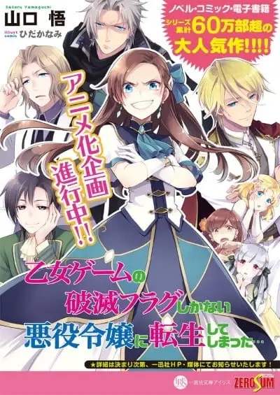

Sebuah visual kunci baru, pemeran tambahan, dan PV untuk Anime Otome Game no Hametsu Flag shika Nai Akuyaku Reijou ni Tensei shiteshimatta telah terungkap.

Seri baru ini dijadwalkan tayang perdana 4 April.

<iframe width="560" height="315" src="https://www.youtube-nocookie.com/embed/RyBy8uvaFAo" frameborder="0" allow="accelerometer; autoplay; encrypted-media; gyroscope; picture-in-picture" allowfullscreen></iframe>

# Ringkasan

“Aku memulihkan ingatan masa laluku ketika aku dipukul kepalanya oleh batu. Saya Katarina Claes, putri duke yang berusia delapan tahun. Dalam mimpi buruk, di mana tunangan sang pangeran ditentukan, saya menyadari bahwa ini adalah permainan otome dari kehidupan sebelumnya.

Saya telah berubah menjadi penjahat yang mengganggu romansa target penangkapan ... Jika pahlawan mendapat akhir yang bahagia, saya akan diasingkan, tetapi jika dia mendapat akhir yang buruk, saya akan dibunuh. Apakah aku tidak bahagia akhir !? Kenapa hanya buruk !? Entah bagaimana aku harus menghindari kehancuran dan mencapai usia tua dengan damai !! "

# Staf

Direktur: Keisuke Inoue
Komposisi Seri: Megumi Shimizu
Desain Karakter: Miwa Ooshima
ED: Shouta Aoi
Studio: LINK SILVER

# Pemeran

Katarina Claes (CV: Maaya Uchida)
Gerald Stuart (CV: Shouta Aoi | Asami Seto)
Keith Claes (CV: Tetsuya Kakihara | Sora Amamiya)
Alan Stuart (CV: Tatsuhisa Suzuki | Mutsumi Tamura)
Nicole Ascart (CV: Yoshitsugu Matsuoka | M ・ A ・ O)
Inori Minase
Saori Hayami
Miho Okasaki
Toshiki Masuda
Azumi Waki
