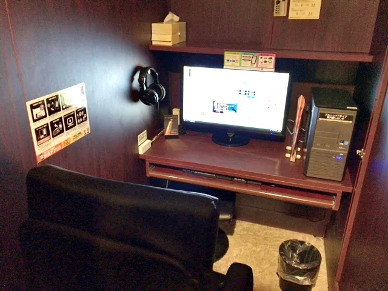

Setelah Perdana Menteri Jepang Abe Shinzo telah menyatakan keadaan darurat di Tokyo dan prefektur sekitarnya, bisnis tidak penting yang sebelumnya tetap terbuka, seperti ruang pachinko dan kafe Starbucks, sekarang ditutup, dalam upaya untuk membuat orang di rumah dan di luar tempat ramai.

Kategori itu juga termasuk kafe internet, yang merupakan tempat bagus dan murah untuk menghabiskan malam jika Anda ketinggalan kereta terakhir, atau membutuhkan hotel murah. Mereka menawarkan kamar pribadi dengan Internet gratis, sering kali termasuk bar minuman ringan gratis dan kadang-kadang bahkan makanan. Di sisi lain, itu juga membuat mereka tempat populer untuk tinggal bagi mereka yang tunawisma atau menganggur dan tidak mampu menyewa apartemen di kota. Bahkan, satu dari empat pelanggan di kafe internet di Tokyo adalah tunawisma.

Sayangnya, menutup kafe internet di sekitar kota berarti bahwa ribuan orang yang kehilangan tempat tinggal tidak akan memiliki tempat untuk tidur selama pandemi. Awalnya pengumuman penutupan seperti itu membuat marah para netizen dan aktivis, yang bertanya-tanya apakah kota itu memiliki rencana untuk mereka.

Untungnya, kota ini, pada kenyataannya, menyediakan perumahan bagi para tunawisma untuk saat ini. Rencana awal adalah menyewakan 400 apartemen pribadi dan unit perumahan pemerintah untuk mereka, tetapi sampai tempat-tempat seperti itu dapat diamankan, mereka telah meminjam jasa hotel bisnis lokal untuk para tunawisma untuk tinggal selama pandemi. Seperti halnya kamar hotel untuk memulihkan pasien coronavirus, perumahan ini akan dibayar oleh kota selama program berlangsung.

Seorang pria tunawisma berusia empat puluhan yang telah tinggal di kafe internet selama tiga tahun terakhir dapat memanfaatkan program ini. Setelah kehilangan pekerjaan sehari-harinya karena wabah itu, ia hanya memiliki sedikit atau bahkan tidak punya uang, dan mulai khawatir ke mana ia bisa pergi sementara kafe-kafe tutup. Dia mengunjungi meja bantuan untuk program bantuan perumahan pada 8 April, dan setelah diberi pengarahan tentang program tersebut, untungnya dapat check-in ke hotel bisnis di Shinjuku pada 10 April.

Tapi tunawisma lain mungkin tidak seberuntung itu. Seperti banyak program bantuan publik, ada peringatan; para tunawisma harus membuktikan bahwa mereka telah tinggal di Tokyo selama lebih dari enam bulan sebelum mereka memenuhi syarat untuk mendapatkan bantuan. Bagi banyak orang yang tinggal di jalanan, itu merupakan tantangan, karena tanpa alamat yang sebenarnya, sulit untuk mendapatkan segala bentuk bukti bahwa Anda telah berada di Tokyo untuk waktu berapa pun. Banyak tunawisma bahkan tidak memiliki ID, sehingga tidak masuk akal untuk mengharapkan mereka memiliki laporan rekening bank, tagihan, atau dokumen lain yang dapat membuktikan kependudukan mereka.

Pria yang disebutkan di atas beruntung memiliki catatan mendonorkan darah dalam setahun terakhir, kalau tidak, ia mungkin akan ditolak. "Saya pikir akan sulit bagi banyak orang lain untuk membuktikan tempat tinggal mereka," katanya kepada NHK News. Setelah kota dapat mengamankan apartemen, ia akan pindah lagi ke lokasi baru, tetapi sementara itu, ia merasa lega tinggal di hotel bisnis, dan akan mencari pekerjaan sambil menerima dukungan dari kota.

Tunawisma seringkali menjadi masalah yang melanda di Jepang, tetapi setidaknya dalam kasus ini para tunawisma teringat ketika kebijakan penutupan bisnis diberlakukan. Kami hanya bisa berharap bahwa penghalang tidak terlalu tinggi bagi banyak orang yang tidak mampu membeli atap di atas kepala mereka di masa-masa sulit ini.

\[[Sora News 24](https://soranews24.com/2020/04/14/internet-cafes-in-tokyo-now-closed-due-to-coronavirus-but-what-about-those-who-live-in-them/utm_source=SEKAI.ID&utm_medium=SEKAI.ID_Source_Link&utm_campaign=SEKAI.ID_Source_Link)\]
